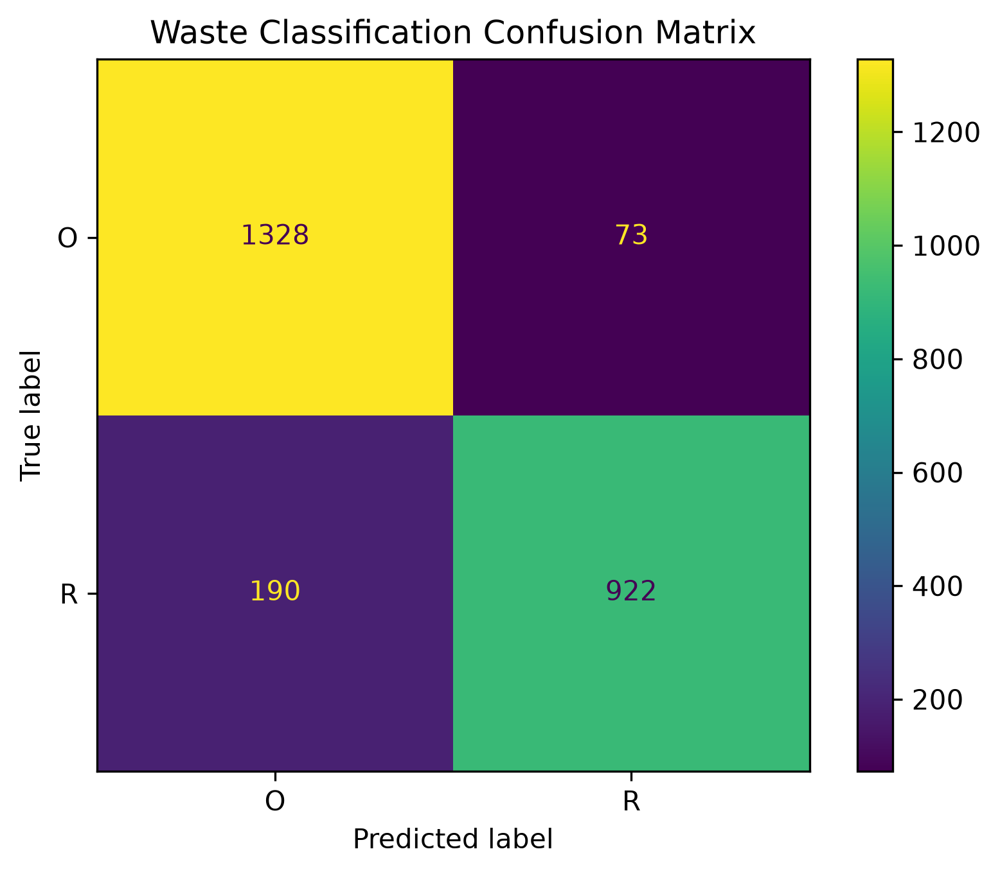

# ♻️ Waste Classification using Deep Learning

A Deep Learning based image classification project that uses a Convolutional Neural Network (CNN) to classify waste images into two categories: **Organic** and **Recyclable**.

## 📌 Project Overview

Waste management is an important environmental challenge. Proper separation of organic and recyclable waste can help improve recycling and reduce environmental pollution.

This project uses Deep Learning and Computer Vision to automatically classify waste images.

### Workflow

Waste Image → Image Preprocessing → CNN Model → Classification → Confidence Score

## 🎯 Objectives

- Build a Deep Learning model for waste classification
- Use a Convolutional Neural Network (CNN)
- Classify waste into Organic and Recyclable categories
- Apply image preprocessing and data augmentation
- Train and validate the CNN model
- Evaluate the trained model
- Generate a confusion matrix
- Build an interactive Streamlit application
- Display prediction confidence
- Upload the project to GitHub

## 🧠 Classes

| Category | Description |
|----------|-------------|
| 🌱 Organic | Food waste, fruits, vegetables and biodegradable waste |
| ♻️ Recyclable | Plastic, paper, cardboard, metal, glass and recyclable materials |

## 📊 Dataset

This project uses the **Waste Classification Data** dataset from Kaggle.

Dataset: https://www.kaggle.com/datasets/techsash/waste-classification-data

The dataset contains approximately 50,000 images and is divided into:

- `O` = Organic
- `R` = Recyclable

The dataset is not included in this repository because of its large size.

## 🏗️ Project Structure

    Waste-Classification-DL/
    │
    ├── app.py
    ├── train.py
    ├── evaluate.py
    ├── plot_training.py
    ├── requirements.txt
    ├── .gitignore
    ├── confusion_matrix.png
    └── README.md

The dataset and virtual environment are excluded from GitHub using `.gitignore`.

## 🔬 Deep Learning Model

The project uses a Convolutional Neural Network built using TensorFlow and Keras.

### CNN Architecture

    Input Image
         ↓
    Conv2D - 32 Filters
         ↓
    MaxPooling2D
         ↓
    Conv2D - 64 Filters
         ↓
    MaxPooling2D
         ↓
    Conv2D - 128 Filters
         ↓
    MaxPooling2D
         ↓
    Flatten
         ↓
    Dense - 128 Neurons
         ↓
    Dropout - 0.5
         ↓
    Output Layer
         ↓
    Organic / Recyclable

## ⚙️ Technologies Used

- Python 3.11
- TensorFlow 2.21.0
- Keras
- Convolutional Neural Network (CNN)
- NumPy
- Pandas
- Scikit-learn
- Matplotlib
- Seaborn
- Pillow
- Streamlit
- Git
- GitHub

## 📈 Model Performance

The trained CNN model achieved:

**Test Accuracy: 89.53%**

**Test Loss: 0.2801**

## 📊 Model Evaluation

The model was evaluated using:

- Accuracy
- Loss
- Precision
- Recall
- F1-Score
- Confusion Matrix

### Confusion Matrix

## 🖥️ Streamlit Application

The project includes an interactive Streamlit web application.

Users can:

- Upload a waste image
- Preview the uploaded image
- Run the CNN model
- View the predicted category
- View prediction confidence
- View Organic probability
- View Recyclable probability

## 🚀 Installation

### 1. Clone the Repository

    git clone https://github.com/kukatireshmitha986-create/Waste-Classification-DL.git

### 2. Navigate to the Project

    cd Waste-Classification-DL

### 3. Create a Virtual Environment

    python -m venv venv

### 4. Activate the Virtual Environment

For Windows:

    .\venv\Scripts\Activate.ps1

For Linux/macOS:

    source venv/bin/activate

### 5. Install Dependencies

    pip install -r requirements.txt

## 📂 Dataset Setup

Download the dataset from Kaggle:

https://www.kaggle.com/datasets/techsash/waste-classification-data

Extract the dataset into the project directory.

Expected structure:

    Waste-Classification-DL/
    │
    ├── DATASET/
    │   ├── TRAIN/
    │   │   ├── O/
    │   │   └── R/
    │   │
    │   └── TEST/
    │       ├── O/
    │       └── R/
    │
    ├── app.py
    ├── train.py
    ├── evaluate.py
    └── requirements.txt

## 🏋️ Train the Model

Run:

    python train.py

The training script performs:

1. Dataset loading
2. Image resizing
3. Pixel normalization
4. Data augmentation
5. Training and validation
6. CNN model creation
7. Model training
8. Model evaluation
9. Model saving

The trained model is saved as:

    waste_classifier.keras

## 📊 Evaluate the Model

Run:

    python evaluate.py

The evaluation script generates:

- Test accuracy
- Test loss
- Classification report
- Precision
- Recall
- F1-score
- Confusion matrix

The confusion matrix is saved as:

    confusion_matrix.png

## 🌐 Run the Streamlit Application

Run:

    streamlit run app.py

The application will normally open at:

    http://localhost:8501

## 🖼️ How to Use the Application

1. Start the Streamlit application.
2. Open the application in your browser.
3. Click **Browse files**.
4. Upload a JPG, JPEG or PNG waste image.
5. The CNN model processes the image.
6. The application displays the prediction and confidence.

Example:

    Prediction: Recyclable
    Confidence: 91.25%

## 🔍 Example Predictions

| Waste Image | Expected Category |
|-------------|-------------------|
| 🍌 Banana Peel | Organic |
| 🍎 Food Waste | Organic |
| 🥬 Vegetable Waste | Organic |
| 🥤 Plastic Bottle | Recyclable |
| 📦 Cardboard | Recyclable |
| 📰 Paper | Recyclable |
| 🥫 Metal Can | Recyclable |
| 🍾 Glass Bottle | Recyclable |

## ✨ Key Features

- ✅ CNN-based image classification
- ✅ Organic waste classification
- ✅ Recyclable waste classification
- ✅ Image preprocessing
- ✅ Data augmentation
- ✅ Training and validation
- ✅ Model evaluation
- ✅ Classification report
- ✅ Confusion matrix
- ✅ Prediction confidence
- ✅ Interactive Streamlit interface
- ✅ GitHub-ready project

## 📁 Important Files

| File | Description |
|------|-------------|
| `app.py` | Streamlit web application |
| `train.py` | CNN model training |
| `evaluate.py` | Model evaluation |
| `plot_training.py` | Training visualization |
| `requirements.txt` | Python dependencies |
| `.gitignore` | Files excluded from GitHub |
| `confusion_matrix.png` | Model evaluation visualization |

## 🧪 Testing

For testing Organic waste images, use images from:

    DATASET/TEST/O

For testing Recyclable waste images, use:

    DATASET/TEST/R

You can also test the application using your own waste images.

For better predictions:

- Use clear images
- Use good lighting
- Keep one main waste object
- Avoid excessive background clutter

## 📚 Learning Outcomes

This project demonstrates:

- Convolutional Neural Networks
- Image Classification
- Computer Vision
- Image Preprocessing
- Image Resizing
- Pixel Normalization
- Data Augmentation
- Training and Validation
- Model Evaluation
- Precision
- Recall
- F1-Score
- Confusion Matrix
- TensorFlow
- Keras
- Streamlit
- Git
- GitHub

## 🔮 Future Improvements

- Add separate classes for plastic, paper, glass and metal
- Add more waste categories
- Use Transfer Learning
- Use MobileNetV2
- Use ResNet50
- Use EfficientNet
- Improve model accuracy
- Add real-time camera detection
- Add object detection
- Deploy the application online
- Add recycling recommendations
- Add Grad-CAM explainable AI
- Build a mobile application
- Use a larger and more diverse dataset
- Add automated waste disposal recommendations

## 🌍 Real-World Applications

This project can potentially be used for:

- Smart waste management systems
- Recycling centers
- Smart bins
- Environmental monitoring
- Waste sorting systems
- Educational applications
- Automated recycling systems

## 🙏 Acknowledgements

- TensorFlow
- Keras
- Streamlit
- Scikit-learn
- Kaggle
- Waste Classification Data dataset

## 👩‍💻 Author

**K. Reshmitha**

**Waste Classification using Deep Learning**

GitHub Repository:

https://github.com/kukatireshmitha986-create/Waste-Classification-DL

## ⭐ Support

If you find this project useful, please consider giving the repository a ⭐ on GitHub.

